# IIDA Floor Plan Viewer — Product Documentation

**Version:** MVP (May 2026)  
**Repo:** [github.com/boss477/IIDA](https://github.com/boss477/IIDA) → `floor-plan-viewer/`  
**Stack:** Vanilla JS · Vite · Three.js · Supabase · LLM Vision · Cloudflare R2  

---

## Table of contents

1. [Product summary](#1-product-summary)
2. [Who it is for](#2-who-it-is-for)
3. [High-level system diagram](#3-high-level-system-diagram)
4. [2D user flow (upload → furnish)](#4-2d-user-flow-upload--furnish)
5. [3D user flow](#5-3d-user-flow)
6. [Catalog & SKU flow](#6-catalog--sku-flow)
7. [Auto-stage flow (room presets)](#7-auto-stage-flow-room-presets)
8. [Vision / LLM pipeline](#8-vision--llm-pipeline)
9. [Screen map (toolbar & UI)](#9-screen-map-toolbar--ui)
10. [2D vs 3D rendering](#10-2d-vs-3d-rendering)
11. [Data model](#11-data-model)
12. [Catalog & storage architecture](#12-catalog--storage-architecture)
13. [Keyboard & interaction reference](#13-keyboard--interaction-reference)
14. [Environment & setup](#14-environment--setup)
15. [Built today vs roadmap](#15-built-today-vs-roadmap)
16. [Performance plan (40+ models)](#16-performance-plan-40-models)
17. [Key source files](#17-key-source-files)

---

## 1. Product summary

**One line:** Upload a 2D floor plan → auto-furnish with your real catalog → edit in 2D → walk the same layout in 3D.

**Problem:** Interior sales and design teams spend hours manually staging floor plans. Customers cannot visualize how real products fit their space before buying.

**Solution:** A web app that:

- Accepts a floor plan image or analyzed JSON
- Detects rooms and applies real-world scale
- Stages furniture from a live product catalog (~130 Shearling SKUs + room presets)
- Lets users swap SKUs, colours, and positions in 2D
- Shows the same layout in a 3D dollhouse with wall paint, move mode, and GLB sofas (premium path)

**North star (roadmap):** Tiered packages — **Standard** = fast SVG presets; **Premium** = photoreal GLB + R2 photos for ~40 hero SKUs per plan.

---

## 2. Who it is for

| Persona | Goal |
|---------|------|
| **Homeowner / buyer** | See their plan with real sofas before purchase |
| **Sales / interior designer** | Stage rooms in minutes, swap SKUs, export JSON |
| **Catalog / ops team** | Maintain SKUs, sizes, colours, images in Supabase + R2 |

---

## 3. High-level system diagram

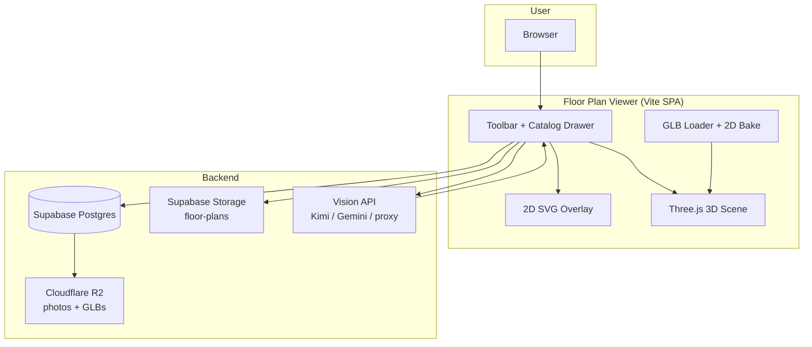

---

## 4. 2D user flow (upload → furnish)

### 4.1 Main journey

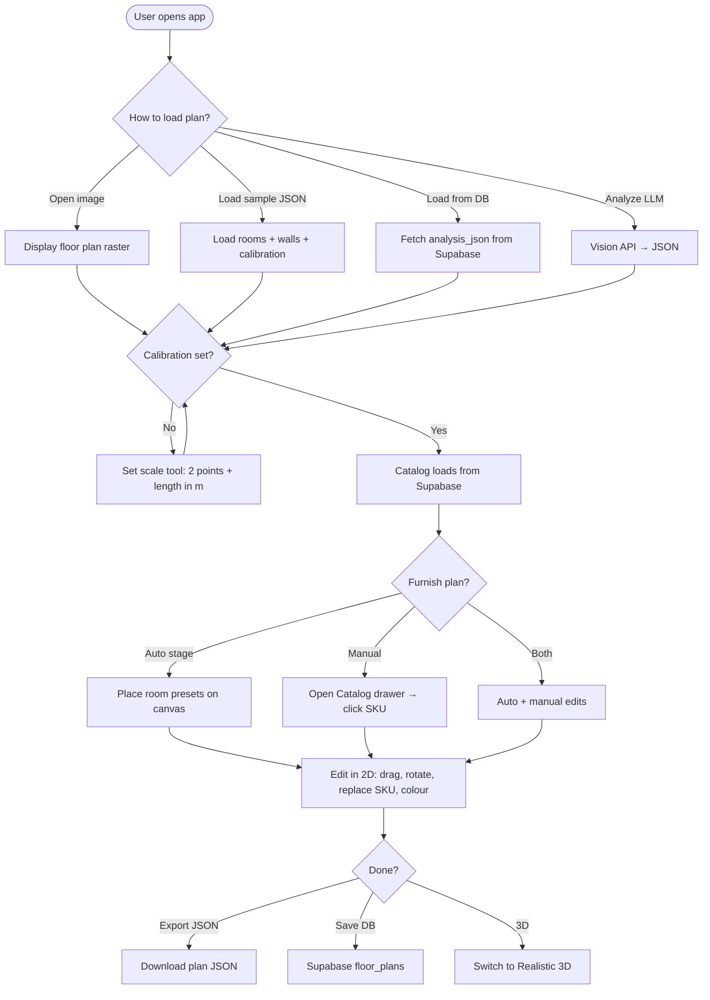

### 4.2 Detailed 2D steps

| Step | User action | System result |
|------|-------------|---------------|
| 1 | **Open image** | PNG/JPG under SVG overlay; pan/zoom enabled |
| 2 | **Set scale** (if needed) | Two-point calibration → mm-per-pixel for real furniture sizes |
| 3 | **Analyze LLM** (optional) | AI returns room polygons, walls, labels |
| 4 | **Auto stage** | Furniture placed per room type (see §7) |
| 5 | **Select furniture** | Blue ring; info bar + 2s tooltip with dimensions |
| 6 | **Replace with** | Pick Shearling SKU or room preset; size + icon update |
| 7 | **Color** | Sofa/chair colour from Supabase `Colours` column |
| 8 | **Drag / arrow keys** | Move within room bounds; `[` `]` rotate ±5° |
| 9 | **Catalog drawer** | Browse, filter, favourite, add SKUs manually |
| 10 | **Export / Save** | JSON file or Supabase persistence |

### 4.2 Geometry tools (optional path)

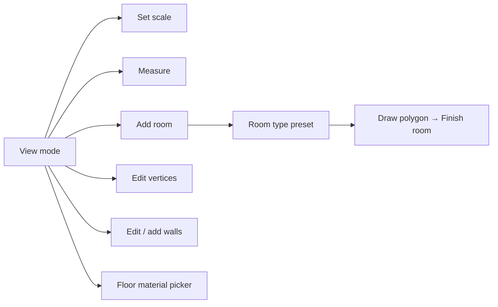

---

## 5. 3D user flow

### 5.1 Journey diagram

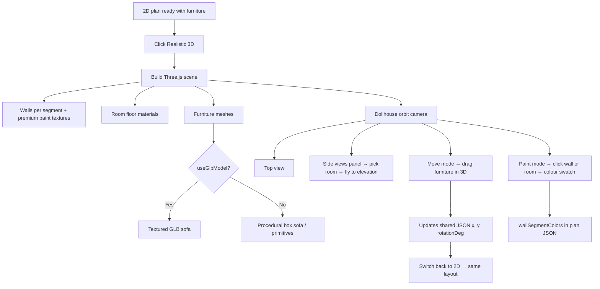

### 5.2 3D toolbar controls

| Control | Mode | Behaviour |
|---------|------|-----------|
| **Dollhouse** | Default | Orbit camera around scene |
| **Top view** | Camera | Bird’s-eye orthographic-style view |
| **Side views ▾** | Camera | Room picker → N/S/E/W elevation |
| **Move** | Edit | Drag furniture; syncs to 2D |
| **Paint** | Edit | Per-wall-segment or whole-room paint presets |

### 5.3 3D furniture rules

| Item type | 3D representation |
|-----------|-------------------|
| Demo GLB sofa (`useGlbModel: true`) | Meshy curved grey GLB, scaled to catalog mm |
| Other sofas | Coloured box geometry (fabric from SKU colour) |
| Tables, beds, kitchen | Simple 3D primitives |
| Area rugs | **2D only** — hidden in 3D |

**Fallback:** If plan has no sofa, one demo GLB is auto-placed at living room centroid.

---

## 6. Catalog & SKU flow

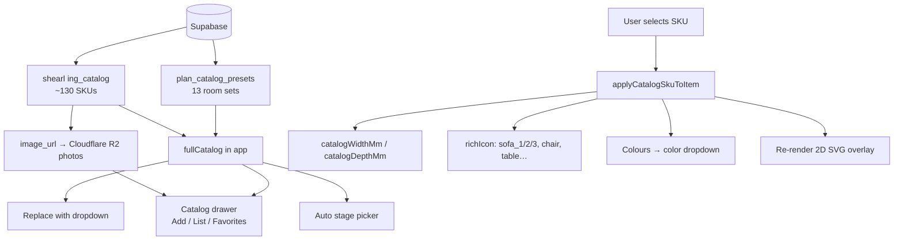

### Catalog drawer tabs

| Tab | Purpose |
|-----|---------|
| **Add** | Grid of product cards (photo, code, name, W×D mm) |
| **List** | All items currently placed on the plan |
| **Favorites** | Starred SKUs (LocalStorage) |

### Filters

- Text search  
- Room: living, bedroom, dining, office  
- Category chips (from catalog categories)  

### Replace dropdown format

```
Product Name · SKU — W × D mm · N-seat rich SVG
```

Example: `NOVARA · SH-NOVARA-001 — 2200 × 950 mm · 3-seat rich SVG`

---

## 7. Auto-stage flow (room presets)

Runs on **app boot** and via **Auto stage** button.

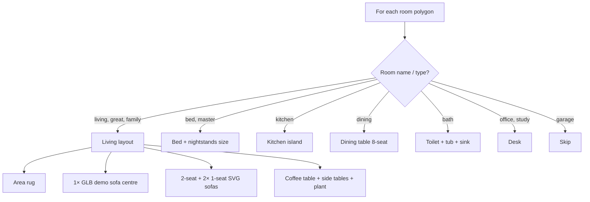

### Living room auto-stage layout (concept)

```
┌─────────────────────────────────────┐
│           LIVING ROOM               │
│                                     │
│      ┌── loveseat (2-seat) ──┐      │
│                                     │
│  ┌arm┐  ┌── GLB 3-seat ──┐  ┌arm┐  │
│  │chair│  (demo model)   │  │chair│  │
│  └────┘  └───────────────┘  └────┘  │
│         ┌ coffee table ┐            │
│    ═══════════ rug ═══════════      │
└─────────────────────────────────────┘
```

---

## 8. Vision / LLM pipeline

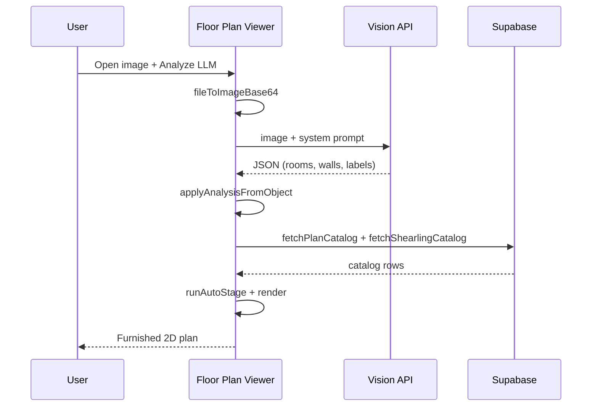

**Supported providers:** Kimi (Fireworks), Google Gemini, `/api/analyze` proxy, LM Studio (local).

**Output schema:** `analysisVersion`, `rooms[]`, `walls[]`, `calibration`, optional `furniture[]`, `doors[]`, `windows[]`.

---

## 9. Screen map (toolbar & UI)

```
┌─────────────────────────────────────────────────────────────────────────────┐
│ ROW 1 — FILE                                                                │
│ [Open image] [Load sample JSON] [Upload plan] [Save DB] [Load DB]          │
│ [Catalog] [+] [−] [Reset] [Export JSON] [Analyze LLM] [2D View] [Realistic 3D]│
├─────────────────────────────────────────────────────────────────────────────┤
│ ROW 2 — GEOMETRY                                                            │
│ [Set scale] [Measure] [Edit vertices] [Add room] [Edit walls] [Add wall]   │
│ [Room preset ▼] [Finish room] [Undo] [Floor ▼] [Measure readout]           │
├─────────────────────────────────────────────────────────────────────────────┤
│ ROW 3 — FURNITURE                                                           │
│ Replace with [▼ SKU dropdown]  Color [▼]  [+ near]  [Auto stage]           │
│ [Furniture info bar]  [Catalog status]  [Scale readout]  [Tool hint]       │
├─────────────────────────────────────────────────────────────────────────────┤
│                                                                             │
│   ┌────────────────────── CATALOG DRAWER (slide-in) ──────────────────┐    │
│   │ [Add] [List] [Favorites]                              [✕ Close]   │    │
│   │ 🔎 Search    Room [▼]    Category [▼]    [chip filters]           │    │
│   │ ┌─────┐ ┌─────┐ ┌─────┐                                           │    │
│   │ │ SKU │ │ SKU │ │ SKU │  …                                        │    │
│   │ └─────┘ └─────┘ └─────┘                                           │    │
│   └───────────────────────────────────────────────────────────────────┘    │
│                                                                             │
│   ┌──────────────── PLAN CANVAS ─────────────────────────────────────┐    │
│   │  [Floor plan image]                                               │    │
│   │  [SVG overlay: rooms, walls, furniture, selection rings]          │    │
│   │  [Floating tooltip — 2s auto-hide on furniture select]            │    │
│   └───────────────────────────────────────────────────────────────────┘    │
└─────────────────────────────────────────────────────────────────────────────┘
```

### 3D chrome (when active)

```
┌─────────────────────────────────────────────────────────────┐
│ [Dollhouse] | [Top view] | [Side views ▾] | [Move] | [Paint ▾ swatches] │
├─────────────────────────────────────────────────────────────┤
│                                                             │
│              Three.js viewport (WebGL)                        │
│                                                             │
│  [Side panel: room list for elevation picks — optional]     │
└─────────────────────────────────────────────────────────────┘
```

---

## 10. 2D vs 3D rendering

### 2D icon priority (per furniture item)

**Seating (sofas + chairs):** rich SVG by seat count (`sofa_1` / `sofa_2` / `sofa_3` / `chair`). Catalog `3d_url` is used for **3D only** — not for 2D GLB bake unless `useGlbBake` is set explicitly (e.g. living-room demo).

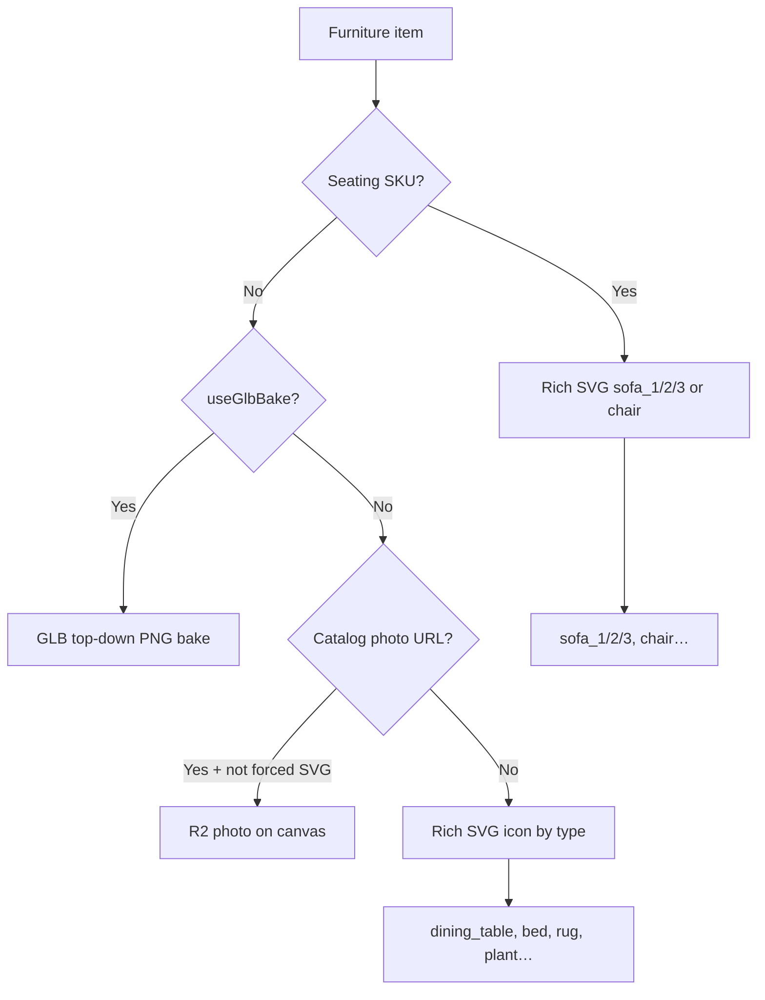

### 3D mesh priority

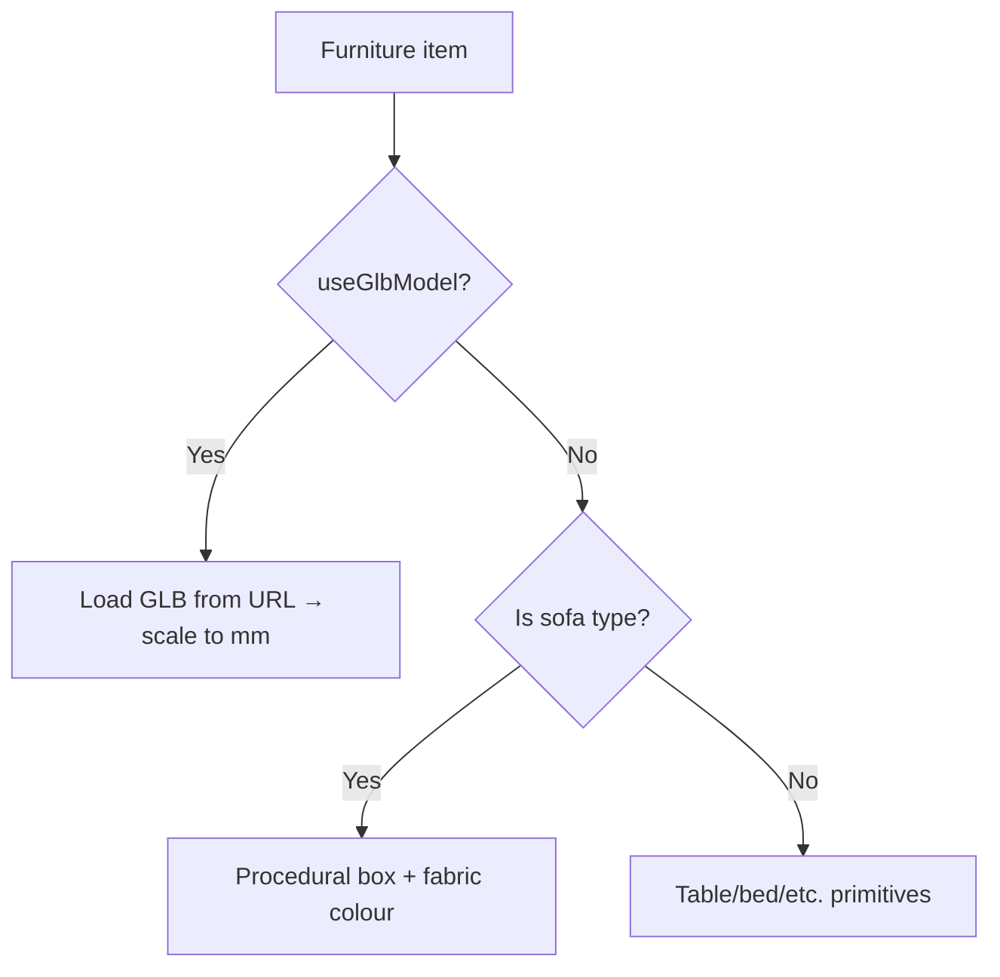

---

## 11. Data model

### Plan JSON (in memory + `floor_plans.analysis_json`)

```json
{
  "analysisVersion": "1.0",
  "label": "Edited floor plan",
  "calibration": {
    "segments": [
      { "x1": 0.1, "y1": 0.2, "x2": 0.5, "y2": 0.2, "lengthM": 4.0 }
    ]
  },
  "rooms": [
    {
      "id": "living",
      "name": "Living Room",
      "type": "living",
      "polygon": [{ "x": 0.1, "y": 0.1 }, "..."],
      "floorMaterial": "oak"
    }
  ],
  "walls": [
    { "id": "w1", "points": [{ "x": 0.1, "y": 0.1 }, "..."], "roomId": "living" }
  ],
  "furniture": [
    {
      "id": "auto-1-abc",
      "catalogId": "SH-NOVARA-001",
      "type": "sofa",
      "richIcon": "sofa_3",
      "x": 0.45,
      "y": 0.52,
      "rotationDeg": 0,
      "catalogWidthMm": 2200,
      "catalogDepthMm": 950,
      "catalogHeightMm": 850,
      "sofaColorOverride": "teal",
      "stageSource": "auto",
      "useGlbModel": true,
      "useGlbBake": true,
      "glbUrl": "/models/Meshy_AI_Curved_Grey_Sofa_0530184643_texture.glb",
      "iconMode": "glb"
    }
  ],
  "wallSegmentColors": {
    "w1-0": "warm-white"
  },
  "doors": [],
  "windows": []
}
```

**Coordinates:** Normalized **0–1** relative to plan image (origin top-left). SVG overlay converts to pixel `viewBox`.

### Catalog row (mapped from Supabase)

| Field | Source | Use |
|-------|--------|-----|
| `id` / `product_code` | Shearling | Replace dropdown, catalogId |
| `name` | Product Name + Code | Labels |
| `category` | Category | Icon inference, filters |
| `width_mm`, `depth_mm`, `height_mm` | DB columns | Real plan size |
| `colours` / `Colours` | DB | Color dropdown |
| `image_url` | R2 URL | 2D photo + catalog cards |
| `model_3d_url` | R2 GLB (roadmap) | 3D mesh |
| `plan2d_glb_url` | R2 PNG (roadmap) | Fast 2D thumb |

---

## 12. Catalog & storage architecture

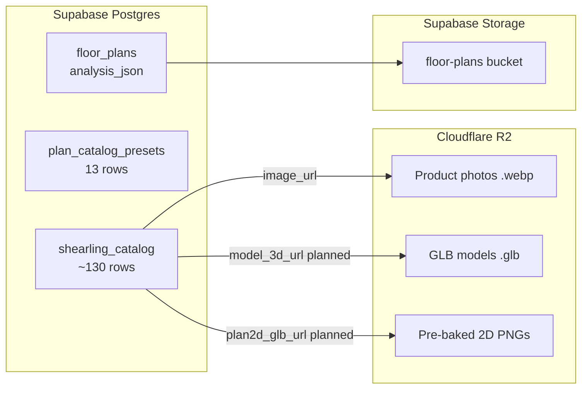

### Image coverage (current audit)

| Metric | Value |
|--------|-------|
| Shearling SKUs | 130 |
| With `image_url` | 104 (80%) |
| Missing image | 26 (mostly chairs / bar stools) |
| GLB in production | 1 demo (curved grey sofa) |

---

## 13. Keyboard & interaction reference

| Input | Context | Action |
|-------|---------|--------|
| **Arrow keys** | Furniture selected | Move (Shift = larger step) |
| **`[` / `]`** | Furniture selected | Rotate ±5° |
| **Escape** | Any | Exit tool / deselect furniture |
| **Ctrl+Z** | Geometry edit | Undo |
| **Click** | View mode | Select room or furniture |
| **Drag** | Furniture | Move on plan |
| **Mouse wheel + drag** | Canvas | Pan / zoom plan |

---

## 14. Environment & setup

### Required env vars

```env
VITE_SUPABASE_URL=https://xxxx.supabase.co
VITE_SUPABASE_ANON_KEY=eyJ...
```

### Optional (vision)

- Kimi / Fireworks API key  
- Google Gemini API key  
- Or local `server.mjs` analyze proxy  

### Run locally

```bash
cd floor-plan-viewer
npm install
npm run dev
# → Vite dev server + Python app on port from app.py
```

### Build

```bash
npm run build
# → dist/ with public/models/*.glb copied
```

---

## 15. Built today vs roadmap

### ✅ Built (MVP)

| Area | Status |
|------|--------|
| 2D plan upload + pan/zoom | ✅ |
| LLM vision analysis | ✅ |
| Calibration + real mm sizes | ✅ |
| Room / wall geometry tools | ✅ |
| 130 SKU + 13 preset catalog | ✅ |
| Auto-stage by room | ✅ |
| Rich SVG furniture icons | ✅ |
| SKU replace + Supabase colours | ✅ |
| Catalog drawer + R2 photos | ✅ |
| 3D dollhouse + top/side views | ✅ |
| 3D move + wall paint | ✅ |
| 1 GLB demo sofa (2D + 3D) | ✅ |
| Supabase save/load plans | ✅ |
| GitHub deploy path | ✅ |

### 🚧 Roadmap (premium / scale)

| Feature | Target |
|---------|--------|
| 10–40 GLB sofas on R2 | Per-SKU `model_3d_url` |
| Pre-baked 2D PNG per GLB | `plan2d_glb_url` — no client bake |
| SKU ↔ GLB name manifest | Product Code mapping |
| Price tier (standard / premium) | Filter auto-stage + GLB access |
| Meshopt GLB compression | 11 MB → 2–4 MB |
| Lazy 3D load + LRU cache | Max ~5 GLBs in memory |
| LOD high/low detail | Phase 2 (zoom / select) |

---

## 16. Performance plan (40+ models)

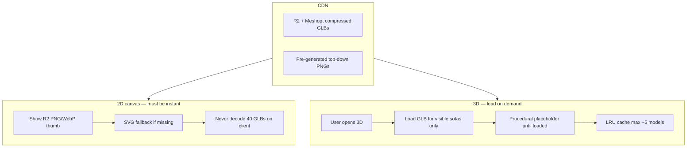

| Rule | Why |
|------|-----|
| 2D uses images not GLBs | Decode 40 meshes = slow on mobile |
| 3D lazy load | User may never open 3D |
| Compress GLBs | 11 MB × 40 = unusable download |
| Tier filter | Premium gets N GLB pieces, not all 40 |

---

## 17. Key source files

| Area | Path |
|------|------|
| App shell + toolbar | `src/viewer/floorPlanViewer.js` |
| 2D SVG render | `src/viewer/svgRenderer.js` |
| 2D furniture icons | `src/viewer/furniture2dRender.js`, `richFurnitureIcons.js` |
| Auto-stage | `src/viewer/roomAutoStage.js` |
| Catalog drawer | `src/viewer/catalogDrawer.js` |
| SKU sizing / replace | `src/lib/catalogSizing.js` |
| Sofa colours | `src/lib/sofaColors.js` |
| GLB demo config | `src/lib/glbDemoSofa.js` |
| Supabase | `src/services/supabase.js` |
| Vision / LLM | `src/services/vision.js` |
| 3D scene | `src/viewer/plan3dViewer.js` |
| GLB loader | `src/viewer/plan3dGlb.js` |
| 2D GLB bake | `src/viewer/glbTopDownBake.js` |
| 3D wall paint | `src/viewer/plan3dWallPaint.js` |
| Geometry tools | `src/viewer/geometryEditor.js` |
| Toolbar mount | `src/viewer/toolbar.js` |
| Room presets fallback | `src/lib/planFurniturePresets.js` |

---

## Appendix A — One-page pitch

> **Upload your floor plan. We auto-furnish it with your real catalog in 2D, then walk through it in 3D.**  
> Real Shearling SKUs, real millimetre sizes, real colours from Supabase. Premium customers see photoreal GLB sofas from Cloudflare R2; standard tier gets fast SVG staging. Sales teams stage a whole home in one click.

---

## Appendix B — Related docs (planned)

| Doc | Purpose |
|-----|---------|
| `docs/R2-UPLOAD.md` | R2 API token setup + `npm run r2:upload` (no `wrangler login`) |
| `docs/CATALOG.md` | SKU ↔ R2 ↔ GLB mapping spec |
| `docs/USER-FLOWS.md` | QA checklist with screenshots |
| `supabase/storage-notes.md` | Bucket setup |

---

*Last updated: May 2026 · IIDA / floor-plan-viewer MVP*
